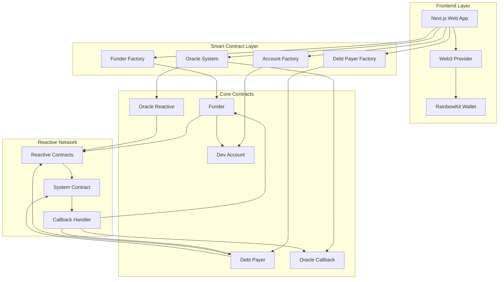
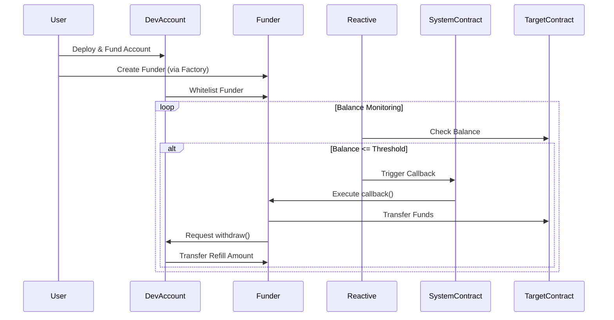
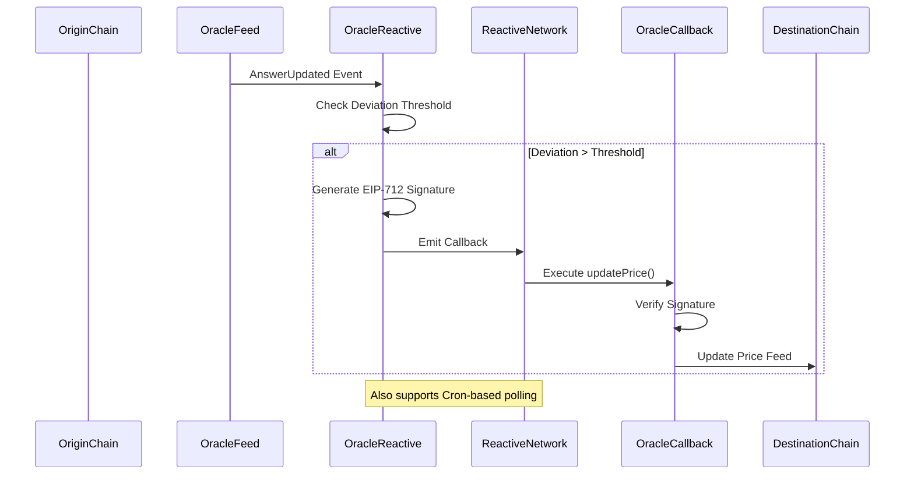
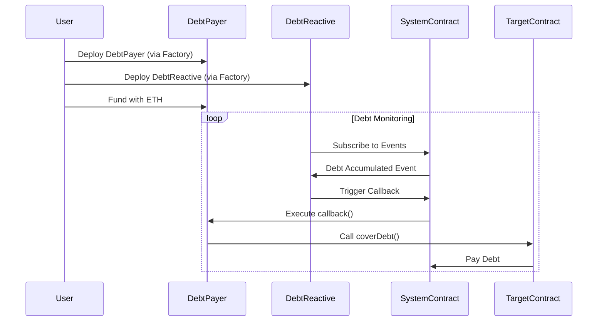
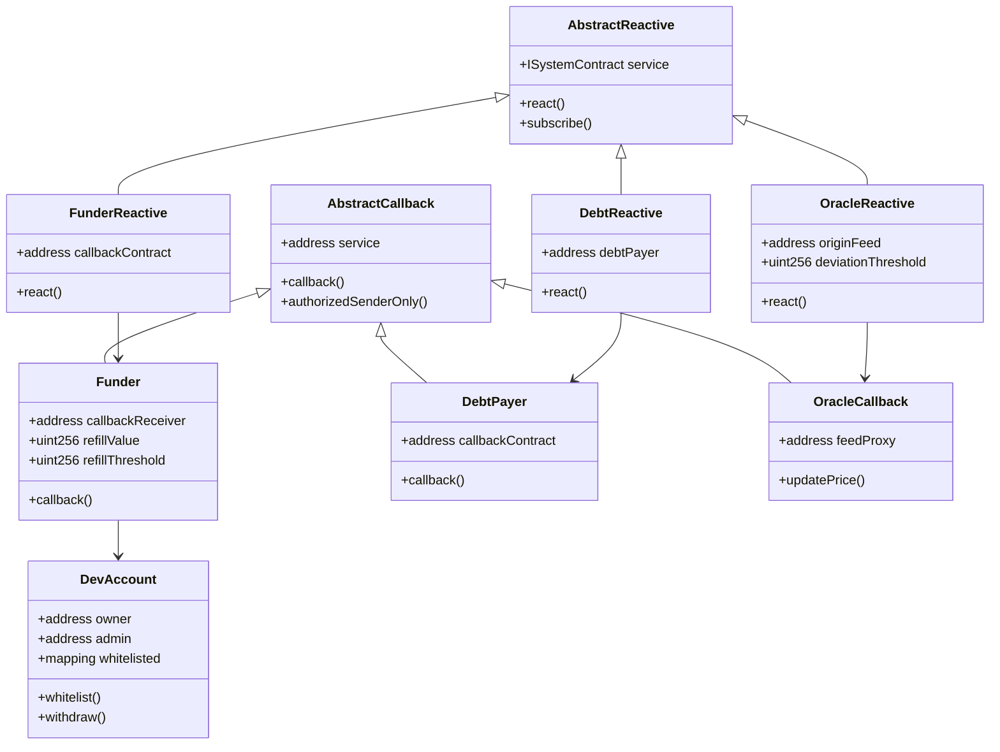

# ReactFeed

A reactive blockchain platform enabling automated cross-chain operations, smart contract automation, and oracle services using the Reactive Network.

##  Deployed Contracts

All contracts are deployed and operational on testnets:

### Ethereum Sepolia (Chain ID: 11155111)
| Contract | Address | Block Explorer |
|----------|---------|----------------|
| **AccountFactory** | `0xe54a966ba44017c9431C3008f8592186A2aF0D36` | [View on Etherscan](https://sepolia.etherscan.io/address/0xe54a966ba44017c9431C3008f8592186A2aF0D36) |
| **FunderFactory** | `0x51F3c2Eb22BD3aaBcF5159dCDc8a1C3C7DDACaB7` | [View on Etherscan](https://sepolia.etherscan.io/address/0x51F3c2Eb22BD3aaBcF5159dCDc8a1C3C7DDACaB7) |
| **DebtPayerFactory** | `0x94cE3e8BA73477f6A3Ff3cd1B211B81c9c095125` | [View on Etherscan](https://sepolia.etherscan.io/address/0x94cE3e8BA73477f6A3Ff3cd1B211B81c9c095125) |

### Base Sepolia (Chain ID: 84532)
| Contract | Address | Block Explorer |
|----------|---------|----------------|
| **FeedProxy** | `0x324c2dEE3AA3B38a3Fc79313f0b0315582277204` | [View on BaseScan](https://sepolia.basescan.org/address/0x324c2dEE3AA3B38a3Fc79313f0b0315582277204) |
| **OracleCallback** | `0xbCce91031005f78ad7De9A9B837fbaae9234C641` | [View on BaseScan](https://sepolia.basescan.org/address/0xbCce91031005f78ad7De9A9B837fbaae9234C641) |

### Reactive Lasna (Chain ID: 5318007)
| Contract | Address | Block Explorer |
|----------|---------|----------------|
| **ReactiveFactory** | `0x6805D21E2cB99e4DfEd8D79fa04CfeE09c8DBC08` | [View on ReactScan](https://lasna.reactscan.net/address/0x6805D21E2cB99e4DfEd8D79fa04CfeE09c8DBC08) |
| **DebtReactiveFactory** | `0xe54a966ba44017c9431C3008f8592186A2aF0D36` | [View on ReactScan](https://lasna.reactscan.net/address/0xe54a966ba44017c9431C3008f8592186A2aF0D36) |
| **OracleReactive** | `0x51F3c2Eb22BD3aaBcF5159dCDc8a1C3C7DDACaB7` | [View on ReactScan](https://lasna.reactscan.net/address/0x51F3c2Eb22BD3aaBcF5159dCDc8a1C3C7DDACaB7) |

**Total**: 8 contracts deployed across 3 networks • [Full Deployment Details](./FINAL_DEPLOYMENT_SUMMARY.md)

---

## Overview

ReactFeed is a comprehensive blockchain automation platform that leverages reactive programming patterns to enable:

- **Automated Account Funding**: Monitor and automatically refill contract balances
- **Debt Management**: Automatic debt payment for reactive contracts
- **Oracle Services**: Cross-chain price feed relay with deviation-based triggers
- **Developer Accounts**: Secure fund management with whitelist controls

## Architecture

### System Overview



### Funder Module Architecture



### Oracle Module Architecture



### Debt Payer Module Architecture



### Contract Hierarchy



## Project Structure

```
ReactFeed/
├── app/                          # Next.js Frontend Application
│   ├── src/
│   │   ├── app/                  # Next.js App Router
│   │   │   ├── page.tsx         # Landing page
│   │   │   ├── dashboard/       # User dashboard
│   │   │   ├── create-account/  # Account creation flow
│   │   │   └── api/             # API routes
│   │   ├── components/          # React components
│   │   │   ├── ui/              # UI components
│   │   │   ├── layout/          # Layout components
│   │   │   ├── oracle/          # Oracle-specific components
│   │   │   └── sections/        # Page sections
│   │   ├── config/              # Configuration files
│   │   ├── hooks/               # Custom React hooks
│   │   ├── lib/                 # Utility libraries
│   │   ├── providers/           # React context providers
│   │   └── types/               # TypeScript type definitions
│   └── package.json
│
└── Contracts/                    # Smart Contracts (Foundry)
    ├── src/
    │   ├── account/             # Account management contracts
    │   │   ├── devAccount.sol
    │   │   ├── accountFactory.sol
    │   │   ├── bridgeCallback.sol
    │   │   └── bridgeReactive.sol
    │   ├── funder/              # Auto-funding contracts
    │   │   ├── funder.sol
    │   │   ├── reactive.sol
    │   │   ├── funderFactory.sol
    │   │   └── reactiveFactory.sol
    │   ├── debtPayer/           # Debt management contracts
    │   │   ├── debtPayer.sol
    │   │   ├── debtReactive.sol
    │   │   ├── debtPayerFactory.sol
    │   │   └── debtReactiveFactory.sol
    │   └── oracle/              # Oracle relay contracts
    │       ├── OracleReactive.sol
    │       ├── OracleCallback.sol
    │       ├── FeedProxy.sol
    │       └── IAggregatorV3.sol
    ├── script/                  # Deployment scripts
    ├── test/                    # Contract tests
    └── foundry.toml
```

## Core Modules

### 1. Developer Account Module

**Purpose**: Secure fund management with access control

**Key Features**:
- Admin and owner role management
- Whitelist-based withdrawal system
- Factory pattern deployment
- Multi-contract fund distribution

**Contracts**:
- `DevAccount.sol`: Main account contract with access control
- `accountFactory.sol`: Factory for deploying accounts

### 2. Funder Module

**Purpose**: Automated balance monitoring and refilling

**Key Features**:
- Threshold-based balance monitoring
- Automatic fund transfers
- Dual contract support (callback + reactive)
- Integration with DevAccount

**Contracts**:
- `funder.sol`: Callback contract for fund distribution
- `reactive.sol`: Reactive contract for balance monitoring
- `funderFactory.sol`: Factory for funder deployment
- `reactiveFactory.sol`: Factory for reactive deployment

**Flow**:
1. Reactive contract monitors target contract balances
2. When balance drops below threshold, triggers callback
3. Funder contract receives callback and transfers funds
4. Funds sourced from whitelisted DevAccount

### 3. Debt Payer Module

**Purpose**: Automatic debt payment for reactive contracts

**Key Features**:
- Real-time debt monitoring
- Automatic debt clearing
- System contract integration
- Gas optimization

**Contracts**:
- `debtPayer.sol`: Callback contract for debt payment
- `debtReactive.sol`: Reactive contract for debt monitoring
- `debtPayerFactory.sol`: Factory for payer deployment
- `debtReactiveFactory.sol`: Factory for reactive deployment

**Flow**:
1. DebtReactive monitors system contract for debt accumulation
2. On debt detection, triggers callback to DebtPayer
3. DebtPayer calls `coverDebt()` on target contracts
4. Debt cleared from system contract

### 4. Oracle Module

**Purpose**: Cross-chain price feed relay with verification

**Key Features**:
- Event-driven price updates
- Deviation threshold filtering
- EIP-712 signature verification
- Cron-based polling fallback
- Multi-chain support

**Contracts**:
- `OracleReactive.sol`: Monitors origin chain price feeds
- `OracleCallback.sol`: Updates destination chain feeds
- `FeedProxy.sol`: Chainlink-compatible price feed interface
- `IAggregatorV3.sol`: Aggregator interface

**Flow**:
1. OracleReactive subscribes to AnswerUpdated events
2. On price update, checks deviation threshold
3. If deviation exceeds threshold, generates EIP-712 signature
4. Emits callback with price data and signature
5. OracleCallback verifies signature and updates local feed

## Technology Stack

### Frontend
- **Framework**: Next.js 15.5 (React 19)
- **Styling**: Tailwind CSS 4
- **Web3**: 
  - wagmi 2.16
  - viem 2.37
  - RainbowKit 2.2
  - ethers.js 6.15
- **State Management**: TanStack Query 5.87
- **UI**: lucide-react, react-hot-toast
- **Backend**: Firebase 12.3

### Smart Contracts
- **Framework**: Foundry (Forge, Cast, Anvil)
- **Language**: Solidity ^0.8.0
- **Libraries**: reactive-lib (Abstract contracts)

## Getting Started

### Prerequisites
- Node.js 18+
- Foundry
- MetaMask or compatible Web3 wallet

### Frontend Setup

```bash
cd app
npm install
cp .env.example .env
# Configure environment variables
npm run dev
```

The app will be available at `http://localhost:3000`

### Smart Contract Setup

```bash
cd Contracts
forge install
forge build
forge test
```

### Deploy Contracts

```bash
# Deploy account factory
forge script script/DeployAccountFactory.s.sol --rpc-url <RPC_URL> --private-key <PRIVATE_KEY>

# Deploy funder system
forge script script/DeployFunderSystem.s.sol --rpc-url <RPC_URL> --private-key <PRIVATE_KEY>

# Deploy oracle system
forge script script/DeployOracleSystem.s.sol --rpc-url <RPC_URL> --private-key <PRIVATE_KEY>
```

## Environment Variables

### Frontend (.env)
```
NEXT_PUBLIC_WALLETCONNECT_PROJECT_ID=your_project_id
NEXT_PUBLIC_ACCOUNT_FACTORY_ADDRESS=0x...
NEXT_PUBLIC_FUNDER_FACTORY_ADDRESS=0x...
NEXT_PUBLIC_DEBT_PAYER_FACTORY_ADDRESS=0x...
NEXT_PUBLIC_ORACLE_ADDRESS=0x...
```

### Contracts (.env)
```
PRIVATE_KEY=your_private_key
RPC_URL=your_rpc_url
ETHERSCAN_API_KEY=your_api_key
```

## Key Concepts

### Reactive Network
A blockchain that enables smart contracts to react to events from other chains. Contracts subscribe to events and execute callbacks when conditions are met.

### Callback Pattern
Two-contract system where:
1. **Reactive Contract**: Monitors events and triggers callbacks
2. **Callback Contract**: Executes business logic on callback

### Factory Pattern
Standardized deployment system ensuring:
- Consistent contract initialization
- Upgradeable deployments
- Centralized management
- Event tracking

### Whitelisting
Security mechanism where:
- DevAccount controls fund access
- Only whitelisted contracts can withdraw
- Admin can add/remove contracts
- Prevents unauthorized fund drains

## Use Cases

1. **DApp Gas Tank**: Automatically refill smart contract gas balances
2. **Protocol Maintenance**: Keep protocol contracts funded
3. **Cross-chain Oracles**: Relay price feeds across chains
4. **Debt Management**: Automatic debt clearing for reactive services
5. **Account Abstraction**: Manage multiple contract balances from one account

## Security Considerations

- All factory contracts deploy with deterministic addresses
- Whitelisting prevents unauthorized withdrawals
- EIP-712 signatures prevent oracle manipulation
- Callback authorization restricts execution to system contract
- Deviation thresholds prevent unnecessary oracle updates

## Contributing

Contributions are welcome! Please follow these steps:

1. Fork the repository
2. Create a feature branch
3. Make your changes
4. Write/update tests
5. Submit a pull request

## License

MIT License - See LICENSE file for details

## Links

- [Reactive Network Documentation](https://docs.reactive.network)
- [Foundry Documentation](https://book.getfoundry.sh)
- [Next.js Documentation](https://nextjs.org/docs)
- [RainbowKit Documentation](https://www.rainbowkit.com)

## Support

For questions and support:
- Open an issue on GitHub
- Contact the development team
- Join our Discord community
